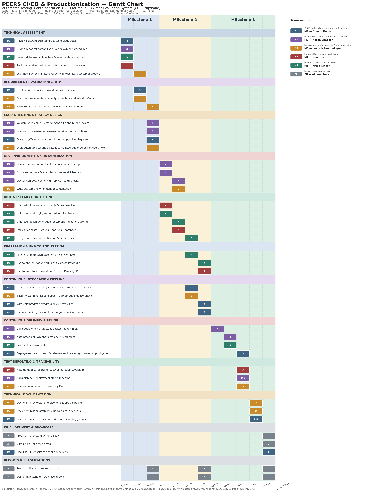

# PEERS: Peer Evaluation System

Productionization, Automated Testing, and CI/CD for the PEERS Peer Evaluation System

Date: 09/18/2026
Status: In Progress — Milestone 1 (Assessment & Planning)

A web-based platform for professors to manage peer evaluations in team-based courses: create and
manage student rosters, assign students to courses/teams, trigger email invitations, and receive
structured, professor-friendly reports with both numeric and textual feedback.

This capstone is a **continuation** of a previous KSU senior capstone project. The application
itself already exists (source: [`SameerHerm/ProjectPeerEvaluation`](https://github.com/SameerHerm/ProjectPeerEvaluation)).
This project's focus is **not new features** — it's transforming the inherited app into a
professionally engineered, production-ready product: automated testing, containerization,
deployment automation, and CI/CD.

---

## Objectives

- Assess the inherited application's architecture, tech stack, and existing test coverage
- Build a full automated testing pyramid: unit, integration, functional regression, and
  end-to-end tests
- Containerize the application (Docker/Docker Compose) and finalize a repeatable local dev setup
- Stand up a Continuous Integration pipeline (build, static analysis, tests, quality gates)
- Stand up a Continuous Delivery pipeline (staging deployment to Render.com, smoke tests) —
  production deployment remains a manual approval step, out of scope
- Maintain a Requirements Traceability Matrix linking business requirements to automated tests
- Document architecture, testing strategy, Docker setup, and release procedures

Explicitly **out of scope**: redesigning the UI, new application features, replacing the tech
stack, a commercial production hosting environment, or migrating databases.

---

## Deployment

**Render.com only** — this is the sponsor's explicit choice; other platforms (Vercel, Railway,
etc.) are not used for this project even though `DEPLOYMENT_GUIDE.md` documents them as
historical alternatives. Deployment is automated via the CI/CD pipeline in
`.github/workflows/` once merged to `main`; there is no separate staging environment beyond
what the pipeline provisions.

---

## Project Timeline and Milestones

📅 **Milestone 1 — Assessment & Planning** — 14 Sep – 04 Oct 2026 (review 28 Sep)
- Application architecture review, technical assessment report
- Requirements validation, critical workflow identification, Requirements Traceability Matrix
- Development environment validation, containerization assessment
- CI/CD architecture design, automated testing strategy

📅 **Milestone 2 — Quality Automation** — 05 Oct – 01 Nov 2026 (review 26 Oct)
- Development environment finalized, containerization completed
- Unit, integration, functional regression, and end-to-end tests implemented
- Continuous Integration pipeline operational with automated quality gates

📅 **Milestone 3 — Productionization** — 02 Nov – 06 Dec 2026 (review 30 Nov, final 06 Dec)
- Continuous Delivery pipeline, automated staging deployment, smoke testing
- Automated test/build reporting, finalized technical documentation
- Final system demonstration and repository delivery

Full per-person, per-week breakdown (sponsor-approved):



---

## Getting Started (For New Users)

### Prerequisites

1. **Install [Node.js and npm](https://nodejs.org/)** — LTS version; npm is included.
2. **Install [Git](https://git-scm.com/)**
3. A code editor, e.g. [VS Code](https://code.visualstudio.com/)

### Setup Steps

1. **Clone the repository**
   ```bash
   git clone https://github.com/dgobin-ksu/ProjectPeerEvaluation.git
   ```
2. **Install dependencies** (installs both frontend and backend)
   ```bash
   npm run setup
   ```
3. **Configure environment variables** — copy `src/backend/.env.example` to `src/backend/.env`
   and fill in `MONGODB_URI` and SMTP settings.
4. **Start the application**
   ```bash
   npm run dev
   ```
5. **Access the app**
   - Frontend: [http://localhost:3000](http://localhost:3000)
   - Backend API: [http://localhost:5000](http://localhost:5000)

### Available Scripts

- `npm run dev` — start both frontend and backend servers simultaneously
- `npm run setup` — install dependencies for both frontend and backend
- `npm run start:backend` / `npm run start:frontend` — start one side only
- `npm test` — frontend unit tests (Jest + React Testing Library)

Not yet on `main` as of this writing — merging soon from open PRs:
- `npm run test:e2e` — end-to-end tests (Playwright)
- `npm run test:backend` — backend unit tests

### Troubleshooting

- Missing dependencies: re-run `npm run setup`.
- Ports 3000/5000 in use: close conflicting apps or change the port in config.
- Email sending issues: check `src/backend/.env` SMTP settings.

---

## Team

| Role | Name | Responsibilities | Contact |
|---|---|---|---|
| Sponsor | Dr. Geetika Vyas | Repository access, functional guidance, requirements validation, milestone reviews | gvyas@kennesaw.edu |
| Team Leader / M1 | Donald Gobin | CI/CD architecture & design, branch governance, CI pipeline, CD pipeline oversight, release procedures, final repository delivery | dgobin@students.kennesaw.edu |
| M2 | Aaron Simpson | Dev environment finalization, Docker/Docker Compose containerization, CD pipeline (artifact/image builds, staging deploy), build/deployment reporting | asimps57@students.kennesaw.edu |
| M3 | Laeticia Neno Aloyem | Requirements validation & Requirements Traceability Matrix, security scanning (Dependabot, OWASP Dependency Check), technical assessment / testing-strategy / architecture documentation | laloyem@students.kennesaw.edu |
| M4 | Khoa Ho | Frontend unit & integration tests, end-to-end student workflow (Playwright), automated test reporting | kho6@students.kennesaw.edu |
| M5 | Kylee Gipson | Backend unit & integration tests, functional regression tests, end-to-end instructor workflow, post-deploy smoke tests | kgipson5@students.kennesaw.edu |
| Advisor / Instructor | Ying Xie | Facilitate progress; advise on planning and project management | yxie2@kennesaw.view.usg.edu |

Primary contact for inquiries: Team Leader (Donald Gobin).

---

## Collaboration & Communication

- Channel: Microsoft Teams
- Weekly async check-ins track task-by-task progress against the project Gantt chart
- Blockers raised at milestone review meetings with the sponsor and advisor

---

## Repository Structure

```
src/
  frontend/       # React 19 (Create React App)
  backend/        # Express + MongoDB (Mongoose); own package.json
e2e/              # Playwright end-to-end tests
docs/
  requirements/
  architecture/
  testing-strategy/
  technical-assessment/
  meeting-notes/
  research-report/
  user-manual/
  gantt/
docker-compose.yml  # currently non-functional — see docs/technical-assessment; being
                     # rebuilt as part of Milestone 2 containerization work
```

---

## Tech Stack

- **Frontend**: React 19, Create React App, MUI, React Router, Formik/Yup, Chart.js/Recharts
- **Backend**: Node.js, Express, MongoDB via Mongoose, JWT auth, Nodemailer
- **Testing**: Jest + React Testing Library (frontend unit), Jest (backend unit — in progress),
  Playwright (end-to-end)
- **CI/CD**: GitHub Actions, deploying to Render.com
- **Containerization**: Docker / Docker Compose (in progress — see Milestone 2)

---

## Security & Privacy

- Restrict access to student data to authorized users only
- HTTPS for all traffic; protect credentials and tokens
- Avoid sending sensitive data in plain text emails
- Comply with institutional policies and applicable regulations (e.g., FERPA)

---

## Contributing

- Use feature branches and open pull requests for review
- Reference the relevant Milestone/task in PR descriptions
- Keep commit messages descriptive

---

Questions or suggestions? Open an issue in this repository or contact the Team Leader.
